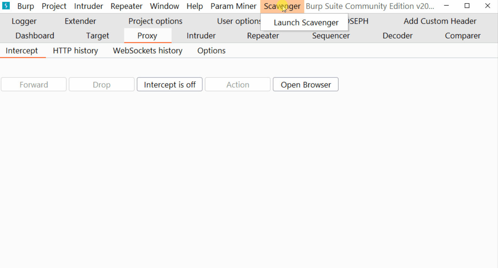

 
 

<h1 align="center">🆂🅲🅰🆅🅴🅽🅶🅴🆁</h1>

<h4 align="center">Burp extension to create target specific and tailored wordlist from burp history.</h4>

---

## Download releases:
`https://github.com/0xDexter0us/Scavenger/releases/`

## Build from source
* `./gradlew build fatjar`
* Grab the jar file `build/libs/Scavenger-x.x.x.jar`

## Installation
1. Download the latest jar from releases or build from source.
2. Add the jar to Burp Suite.

## Usage

* Easy to use ! :) 
* launch from the Menu.
* Select List type, name and location.
* Just click the save button ! 
* **But remember to set the scope first!**
* If you like the project, please give the repo a star! <3
### Resources
[Art of Fuzzing and Creating Tailored Wordlists with Scavenger](https://blog.dexter0us.com/posts/art-of-fuzzing-and-tailored-wordlist/)- By me 
[Real world usage of this tool](https://bendtheory.medium.com/finding-and-exploiting-unintended-functionality-in-main-web-app-apis-6eca3ef000af)-By Bend Theory :skull: 
[Who, What, Where, When, Wordlist by TomNomNom](https://www.youtube.com/watch?v=W4_QCSIujQ4)
## Changelog
**26 November 2021 - v0.7.0**
 - Added filter option to exclude words with png, jpg, gif, woff extension.
 - Fixed the folder selection bug.

**24 November 2021 - v0.5.0**
 - First public release

## Thanks To

* CoreyD97 - https://github.com/CoreyD97
* ScreaMy - https://github.com/aadarsh-screamy

Feel free to suggest any ideas.:slightly_smiling_face:
-----

<h1 align="left">
  

